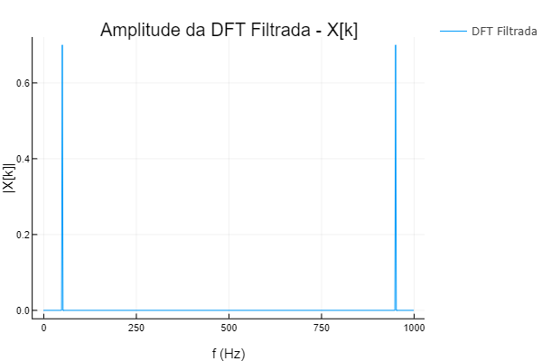

# ecom062-pds
## Digital Signal Processing

Implmentations of Discrete Fourier Transform (DFT), Inverse Discrete Fourier Transform (iDFT) and Fast Fourier Transforms (Radix 2 and Radix 3 FFT).

To run the notebook you must first setup your project environment. In julia REPL type `]` to enter in Pkg mode:

```console
pkg> activate .
pkg> instantiate
```

You can now exit the julia REPL and launch the Pluto notebook with:

```console
$ julia --project=. startPluto.jl
```




